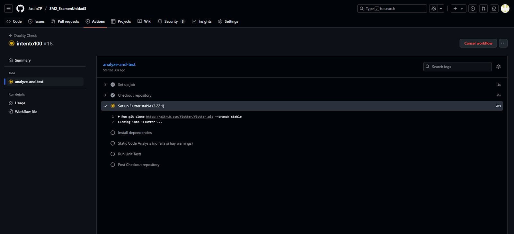
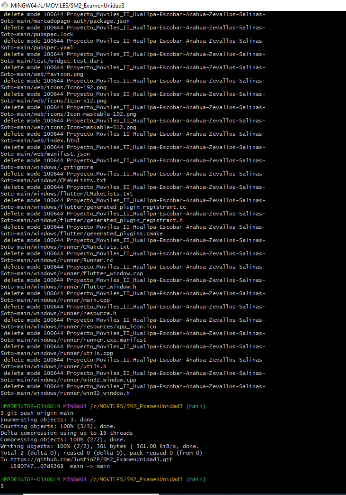
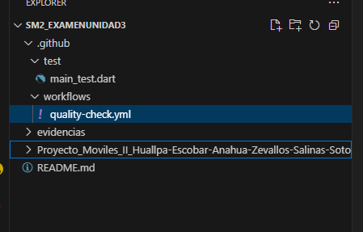
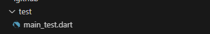
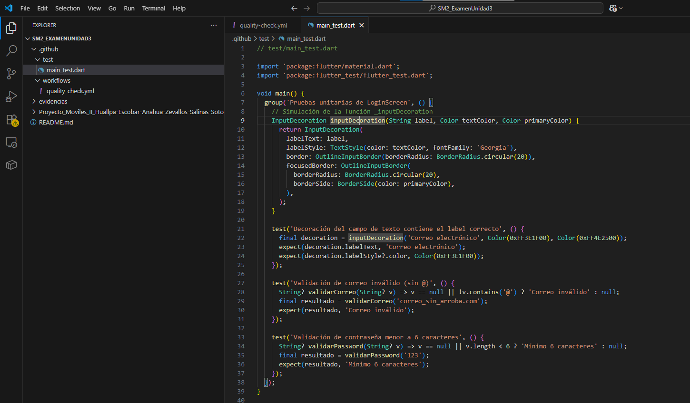

# SM2 - Examen Unidad 3: Automatización de Calidad con GitHub Actions

**Curso:** Desarrollo de Aplicaciones Móviles  
**Fecha:** 27 de junio de 2025  
**Estudiante:** Justin Zinedine ZEVALLOS PURCA

**Repositorio GitHub:**  
🔗 [https://github.com/JustinZP/SM2_ExamenUnidad3.git](https://github.com/JustinZP/SM2_ExamenUnidad3.git)

---

## Ejecución del Workflow en GitHub Actions

Haz clic en la pestaña **Actions** del repositorio para ver la ejecución automática del workflow.  
Se muestra un ejemplo de ejecución exitosa:

- ✅ Análisis con `flutter analyze`
- ✅ Pruebas con `flutter test`
- ✅ Resultado final: **Success** (pasaron sin errores)

---

## Explicación de lo realizado

### 1. Configuración del flujo de trabajo (`.yml`)

- Se configuró para que se ejecute automáticamente cuando se hace un `commit` o `pull request` a la rama `main`.

- El workflow instala Flutter, analiza el proyecto y ejecuta las pruebas unitarias.

---

### 2. Estructura del proyecto

- Se creó la carpeta `.github/workflows` y dentro se colocó el archivo `quality-check.yml`.

- Dentro del proyecto hay una carpeta `/test` con el archivo `main_test.dart` que incluye pruebas unitarias del Login.

---

### 3. Pruebas Unitarias

- Se implementaron al menos **3 pruebas** en `main_test.dart` para verificar el funcionamiento del Login.
- Las pruebas pasan correctamente (`flutter test` ejecutado sin errores).

---

### 4. Análisis de calidad

- Se ejecutó `flutter analyze` para asegurar que el código esté limpio y sin errores de estilo o advertencias críticas.

---

### 5. Automatización

- El flujo de trabajo se ejecuta automáticamente al subir cambios al repositorio público.
- Se verificó su ejecución en la pestaña **Actions**.

---

## Consideraciones Finales

- ✅ El repositorio es **público**.
- ✅ El archivo `quality-check.yml` está en la ruta correcta: `.github/workflows/`.
- ✅ El workflow se ejecuta automáticamente al hacer push/pull request.
- ✅ Se incluyó el informe en formato PDF con capturas y explicaciones.
- ✅ El informe está redactado de forma clara y estructurada.

---

📧 Contacto: [jz2020066924@virtual.upt.pe](mailto:jz2020066924@virtual.upt.pe)
